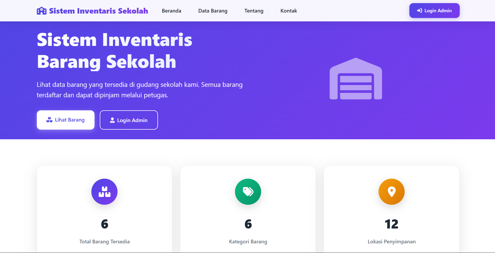
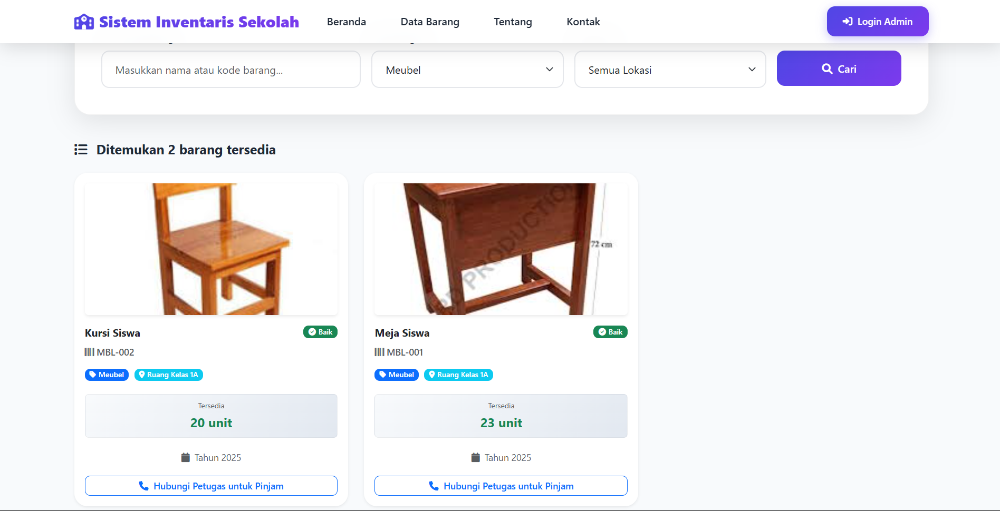
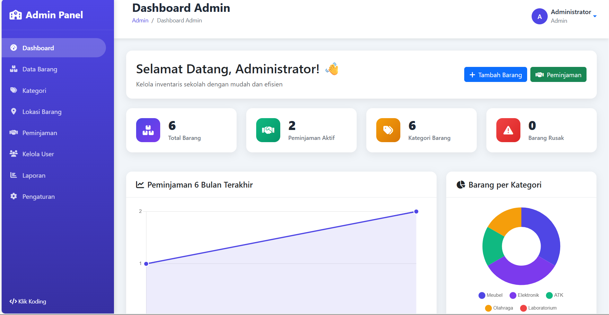
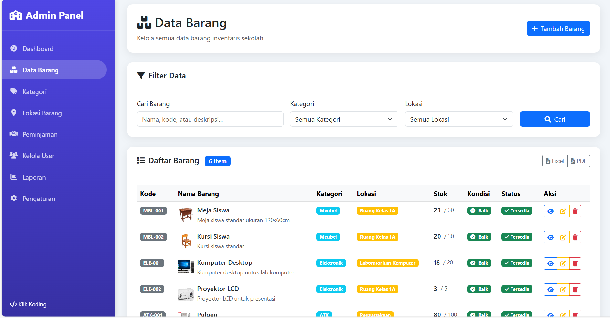
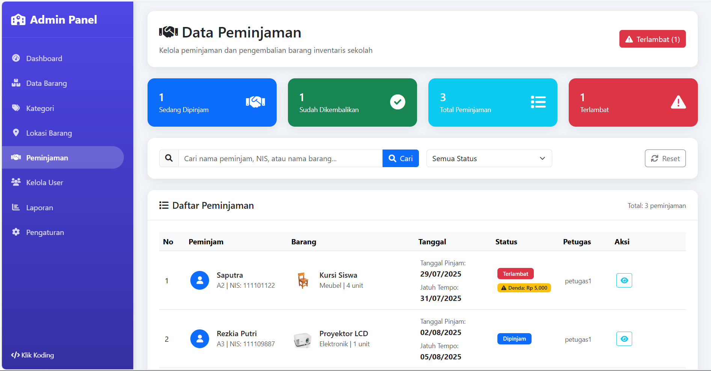
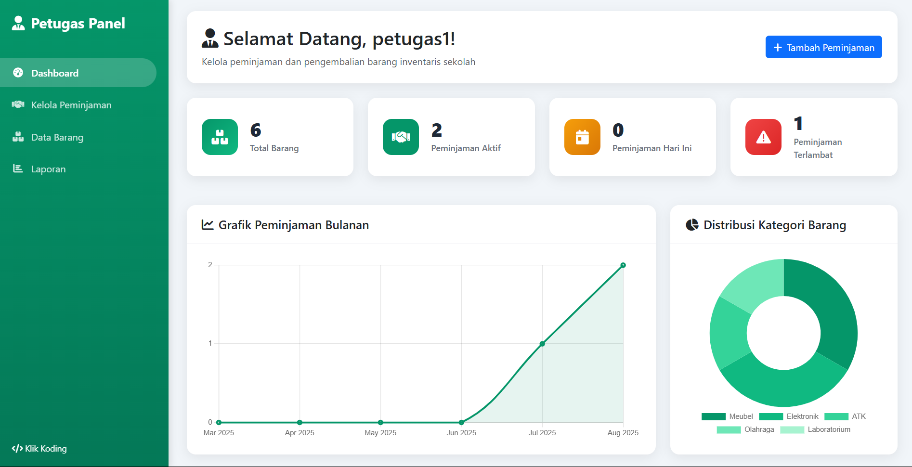
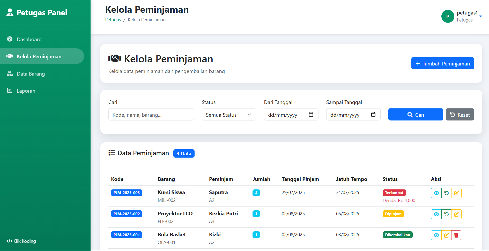

# 📚 Sistem Inventaris Barang Sekolah

[](https://php.net)
[](https://mysql.com)
[](https://getbootstrap.com)
[](https://fontawesome.com)

> **Sistem Inventaris Barang Sekolah** adalah aplikasi web berbasis PHP yang dirancang untuk mengelola dan memantau semua aset/barang milik sekolah seperti meja, kursi, komputer, proyektor, dan barang lainnya. Sistem ini mencatat peminjaman dan pengembalian barang, serta menyediakan laporan komprehensif berdasarkan kondisi, kategori, dan lokasi.

## 🎯 Fitur Utama

### 👥 Multi-Role Access Control

- **Admin**: Akses penuh ke semua fitur sistem
- **Petugas**: Mengelola peminjaman dan pengembalian barang
- **Tamu**: Melihat data barang yang tersedia (tanpa login)

### 📦 Manajemen Barang

- ✅ CRUD data barang (nama, kode, jumlah, kondisi, lokasi)
- ✅ Upload foto barang dengan preview
- ✅ Kategori barang (Elektronik, Furniture, Olahraga, dll)
- ✅ Lokasi penyimpanan (Lab, Kelas, Perpustakaan, dll)
- ✅ Status kondisi (Baik, Rusak Ringan, Rusak Berat)
- ✅ Stok real-time dengan alert stok rendah

### 🔄 Sistem Peminjaman

- ✅ Input data peminjam (nama, kelas, NIS, kontak)
- ✅ Tracking status peminjaman (Dipinjam, Dikembalikan, Terlambat)
- ✅ Tanggal pinjam, rencana kembali, dan aktual kembali
- ✅ Validasi stok otomatis
- ✅ History peminjaman lengkap

### 📊 Laporan & Analytics

- ✅ Dashboard dengan statistik real-time
- ✅ Laporan peminjaman dengan filter
- ✅ Laporan barang terlambat
- ✅ Laporan pengembalian
- ✅ Export data (PDF/Excel) - _Coming Soon_

### 🎨 User Interface

- ✅ Responsive design (Mobile, Tablet, Desktop)
- ✅ Modern UI dengan Bootstrap 5
- ✅ Animasi dan transisi smooth
- ✅ Dark/Light mode ready
- ✅ Loading indicators dan feedback

## 🖼️ Screenshots Demo

### 🏠 Halaman Utama (Tamu)


_Halaman utama untuk tamu yang menampilkan data barang tersedia_

### 📋 Data Barang Tamu


_Tampilan data barang dengan foto dan informasi detail_

### 👨‍💼 Dashboard Admin


_Dashboard admin dengan statistik dan grafik_

### 📦 Data Barang Admin


_Halaman manajemen data barang untuk admin_

### 📊 Data Peminjaman Admin


_Halaman pengelolaan data peminjaman_

### 👨‍💼 Dashboard Petugas


_Dashboard petugas dengan fitur peminjaman_

### 🔄 Kelola Peminjaman Petugas


_Halaman pengelolaan peminjaman untuk petugas_

## 🚀 Cara Menjalankan

### 📋 Prerequisites

- PHP 8.0 atau lebih tinggi
- MySQL 8.0 atau lebih tinggi
- Web Server (Apache/Nginx)
- Composer (opsional)

### ⚙️ Installation

1. **Clone Repository**

```bash
git clone https://github.com/rizkimulyawann/sistem-inventaris-sekolah.git
cd sistem-inventaris-sekolah
```

2. **Setup Database**

```bash
# Import database schema
mysql -u root -p < database/inventaris_sekolah.sql
```

3. **Konfigurasi Database**

```php
// Edit file config/database.php
<?php
return [
    'host' => 'localhost',
    'dbname' => 'inventaris_sekolah',
    'username' => 'root',
    'password' => ''
];
```

4. **Setup Web Server**

```bash
# Untuk Apache, pastikan mod_rewrite aktif
# Untuk Nginx, konfigurasi sesuai kebutuhan
```

5. **Set Permissions**

```bash
chmod 755 uploads/
chmod 644 config/database.php
```

6. **Jalankan Aplikasi**

```bash
# Buka browser dan akses
http://localhost/sistem-inventaris-sekolah
```

### 🔐 Default Login

#### Admin

- **Username**: `admin`
- **Password**: `admin123`
- **Role**: Full Access

#### Petugas

- **Username**: `petugas`
- **Password**: `petugas123`
- **Role**: Peminjaman & Laporan

## 🔄 Alur Sistem

### 📦 Pengelolaan Data Barang

1. **Admin login** ke sistem
2. **Tambah kategori** dan lokasi jika belum ada
3. **Input data barang** dengan foto dan detail
4. **Barang tersimpan** dan bisa dilihat/diupdate
5. **Stok otomatis** terupdate saat peminjaman

### 🔄 Proses Peminjaman

1. **Petugas login** ke sistem
2. **Input data peminjam** (nama, kelas, NIS, kontak)
3. **Pilih barang** yang akan dipinjam
4. **Sistem validasi** stok tersedia
5. **Status berubah** menjadi "Dipinjam"
6. **Stok berkurang** otomatis

### 📤 Proses Pengembalian

1. **Petugas input** tanggal pengembalian aktual
2. **Sistem cek** keterlambatan
3. **Status berubah** menjadi "Dikembalikan"
4. **Stok bertambah** otomatis
5. **History tersimpan** untuk laporan

### 📊 Pembuatan Laporan

1. **Admin/Petugas** buka menu laporan
2. **Filter berdasarkan** kategori/lokasi/kondisi/waktu
3. **Data ditampilkan** dalam format tabel
4. **Export ke PDF/Excel** (fitur mendatang)

## 📝 License

Distributed under the MIT License. See `LICENSE` for more information.

## 👨‍💻 Authors

- **Rizki Mulyawan** - _Initial work_ - [GitHub](https://github.com/rizkimulyawan)
- **Klik Koding** - _Development & Support_ - [YouTube](https://youtube.com/@klikkoding)

## 🙏 Acknowledgments

- [Bootstrap](https://getbootstrap.com) - UI Framework
- [Font Awesome](https://fontawesome.com) - Icons
- [Chart.js](https://chartjs.org) - Charts
- [DataTables](https://datatables.net) - Enhanced Tables

## 📞 Support

Jika ada pertanyaan atau masalah, silakan:

- 📧 Email: rizkimulyawan110404@gmail.com
- 🐛 Issues: [GitHub Issues](https://github.com/rizkimulyawann/sistem-inventaris-sekolah/issues)
- 📺 YouTube: [Klik Koding](https://youtube.com/@klikkoding)

---

⭐ **Jika project ini membantu, jangan lupa berikan star di GitHub!** ⭐
